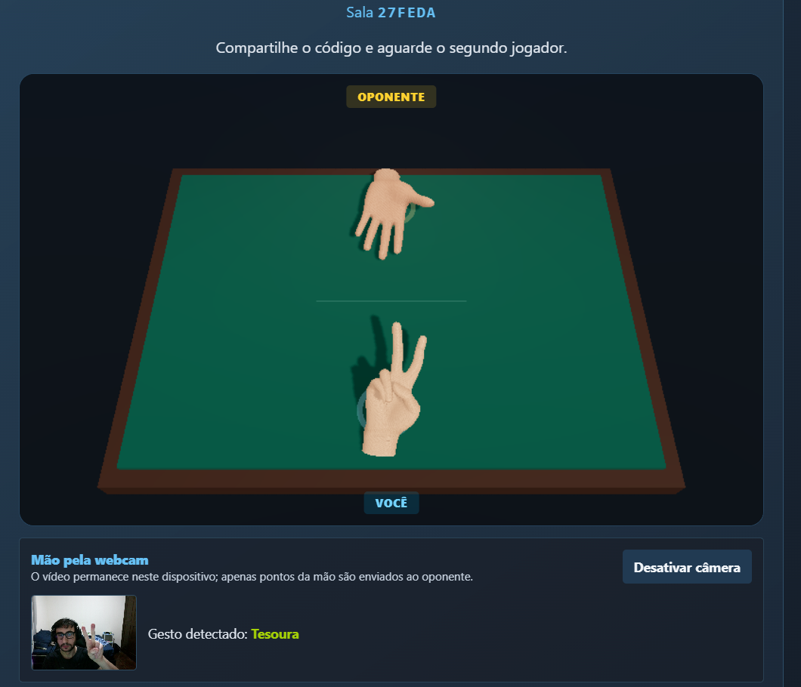
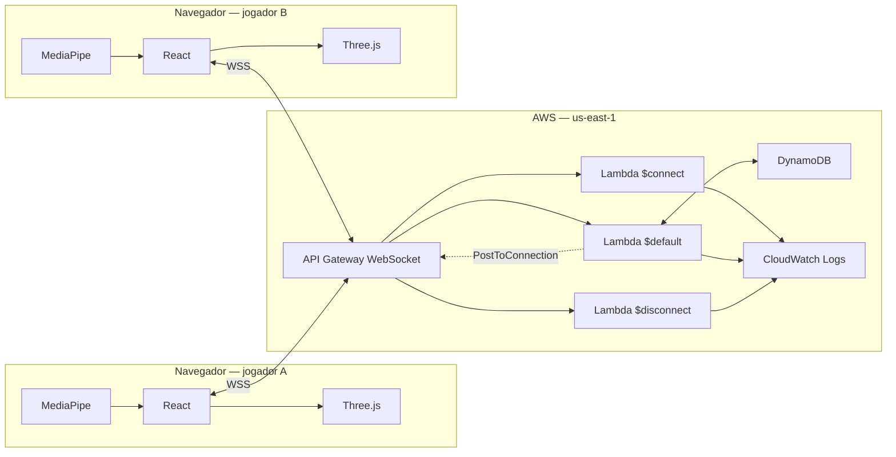

<h1 align="center">Pedra, Papel e Tesoura em tempo real</h1>

<p align="center">
  Jogo multiplayer serverless com WebSocket, reconhecimento de gestos pela webcam e mãos 3D animadas no navegador.
</p>

<p align="center">
  <a href="https://github.com/kaiotcp1/Websocket/actions/workflows/ci.yml"></a>
  <a href="https://github.com/kaiotcp1/Websocket/actions/workflows/terraform.yml"></a>
  <a href="https://github.com/kaiotcp1/Websocket/actions/workflows/destroy.yml"></a>
  <a href="https://github.com/kaiotcp1/Websocket/releases/latest"></a>
</p>

<p align="center">
  
  
  
  
  
</p>

<p align="center">
  
</p>

<p align="center"><em>A webcam é processada localmente; somente os pontos da mão são enviados ao oponente.</em></p>

## Visão geral

Este projeto demonstra uma aplicação WebSocket completa, do navegador à infraestrutura AWS. Dois jogadores entram em uma sala, movimentam mãos 3D com os pontos detectados pelo MediaPipe e fazem a jogada mostrando pedra, papel ou tesoura para a webcam.

O runtime na AWS é totalmente serverless: o API Gateway mantém as conexões WebSocket, Lambdas curtas processam eventos e o DynamoDB conserva apenas o estado necessário da sala. Não há servidor permanente, VPC, NAT Gateway, cache ou fila SQS.

### O que está implementado

- salas isoladas para exatamente dois jogadores;
- comunicação bidirecional por WebSocket seguro (`wss://`);
- reconhecimento local de pedra, papel e tesoura com MediaPipe;
- animação de modelos de mão WebXR/GLB com React Three Fiber e Three.js;
- sincronização dos 21 landmarks da mão com o oponente, sem transmitir o vídeo;
- escolhas privadas até os dois jogadores concluírem a rodada;
- persistência on-demand no DynamoDB, com TTL de 24 horas;
- infraestrutura reproduzível com Terraform e state remoto no S3;
- autenticação do GitHub Actions na AWS por OIDC, sem access keys estáticas;
- releases e tags semânticas criadas depois de um deploy bem-sucedido.

## Como o WebSocket funciona aqui

O socket não fica dentro de uma Lambda. O API Gateway aceita o upgrade para WebSocket, mantém a conexão aberta e atribui um `connectionId` a cada navegador. As Lambdas são executadas somente quando há um evento:

- `$connect` registra a abertura da conexão;
- `$default` recebe os comandos `createRoom`, `joinRoom`, `play` e `handMotion`;
- `$disconnect` remove o vínculo da conexão e abandona a sala;
- para responder depois do processamento, o backend publica no endpoint `@connections` do API Gateway usando o `connectionId` do destinatário.

O `statusCode: 200` retornado pela Lambda apenas confirma ao API Gateway que o evento foi processado. As mensagens JSON vistas pelos jogadores são enviadas separadamente por `PostToConnection`.



O contrato de cada comando, os payloads de resposta e um diagrama de sequência completo estão em [Protocolo WebSocket](docs/websocket/README.md).

## Stack

| Área | Tecnologias |
| --- | --- |
| Interface | React 19, Vite, Tailwind CSS 4 |
| Cena 3D | Three.js, React Three Fiber, modelos GLB WebXR |
| Visão computacional | MediaPipe Hand Landmarker |
| Backend | TypeScript, Node.js 22, AWS Lambda, esbuild |
| Tempo real | Amazon API Gateway WebSocket e Management API `@connections` |
| Persistência | Amazon DynamoDB em `PAY_PER_REQUEST` |
| Observabilidade | CloudWatch access, execution e Lambda logs |
| Infraestrutura | Terraform, provider AWS e provider Archive |
| Entrega | GitHub Actions, AWS OIDC e semantic-release |

## Executar localmente

Pré-requisito: Node.js 22 e npm.

```bash
git clone git@github.com:kaiotcp1/Websocket.git
cd Websocket/apps/frontend
npm ci
npm run dev
```

Abra a URL HTTPS mostrada pelo Vite, aceite o certificado local e informe uma URL WebSocket implantada no campo superior. Abra o cliente em dois navegadores ou dispositivos, crie a sala no primeiro e use o código de seis caracteres no segundo.

Para acessar a partir de outro dispositivo na mesma rede:

```text
https://SEU_IPV4:5173
```

Cada dispositivo precisa aceitar o certificado HTTPS. A webcam depende de um contexto seguro; uma página aberta por HTTP em um endereço da rede pode não expor `navigator.mediaDevices`.

O guia com build do backend, teste via `wscat`, logs e resolução de problemas está em [Desenvolvimento local](docs/development/README.md).

## Estrutura do repositório

```text
.
├── .github/workflows/       # CI, Terraform/deploy e destroy
├── apps/
│   ├── backend/
│   │   └── src/
│   │       ├── controllers/ # parsing e validação do protocolo
│   │       ├── handlers/    # adaptadores das rotas do API Gateway
│   │       ├── models/      # entidades e regras puras do jogo
│   │       ├── repositories/# acesso ao DynamoDB
│   │       └── services/    # casos de uso e mensagens WebSocket
│   ├── frontend/            # React, MediaPipe e ambiente 3D
│   └── infra/               # recursos Terraform e remote state
├── docs/                    # documentação técnica especializada
├── CONTRIBUTING.md          # Conventional Commits e releases
└── README.md
```

## Documentação

| Documento | Conteúdo |
| --- | --- |
| [Índice da documentação](docs/README.md) | mapa dos guias e fontes de verdade |
| [Arquitetura](docs/architecture/README.md) | componentes, camadas, decisões e fluxo ponta a ponta |
| [Protocolo WebSocket](docs/websocket/README.md) | comandos, eventos, estados e diagramas de sequência |
| [Infraestrutura AWS](docs/infrastructure/README.md) | Terraform, DynamoDB, IAM, logs, custos e remote state |
| [Desenvolvimento local](docs/development/README.md) | instalação, testes manuais, LAN, webcam e troubleshooting |
| [CI/CD e releases](docs/ci-cd/README.md) | workflows, OIDC, ZIP das Lambdas e SemVer |

## CI/CD e versionamento

O fluxo padrão é `push na main → CI → Terraform → deploy autorizado → tag/release`. Pull requests executam os builds e validam o Terraform sem alterar a AWS. O workflow de destroy possui um controle explícito e compartilha o mesmo state remoto do deploy.

Os badges no início deste README apontam diretamente para os workflows reais. Um badge verde de CI significa que type-check e build do backend, além do build do frontend, passaram; ele não representa cobertura de testes automatizados.

Commits seguem [Conventional Commits](CONTRIBUTING.md):

- `fix:` gera uma versão patch;
- `feat:` gera uma versão minor;
- `feat!:` ou `BREAKING CHANGE:` gera uma versão major.

Detalhes em [CI/CD e releases](docs/ci-cd/README.md).

## Decisões e limites atuais

- uma sala comporta dois jogadores e uma única rodada;
- não há autenticação de usuário: o `connectionId` identifica o socket, não uma pessoa;
- a infraestrutura Terraform deste repositório implanta o backend, não hospeda o frontend;
- o movimento da mão é efêmero e não é persistido no DynamoDB;
- a implementação atual não usa SQS, VPC, NAT Gateway ou cache;
- o cliente baixa o runtime/modelo do MediaPipe de serviços externos ao ativar a câmera;
- custos AWS podem existir mesmo em uma arquitetura on-demand; use o workflow de destroy quando o ambiente não for necessário.

Essas escolhas mantêm o escopo focado no ciclo completo de WebSocket, serverless, infraestrutura como código e renderização 3D em tempo real.
