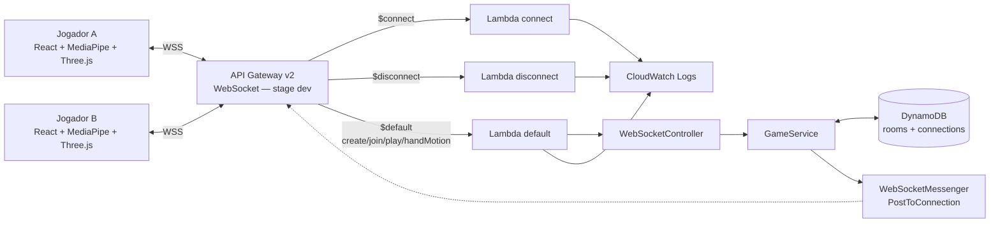
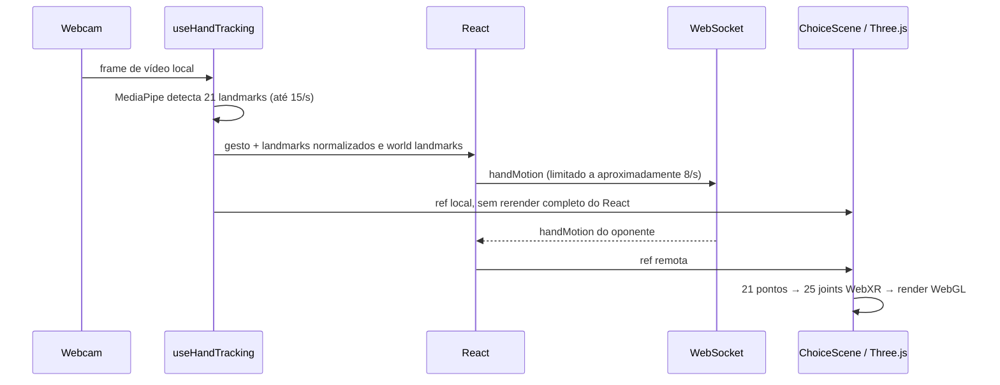
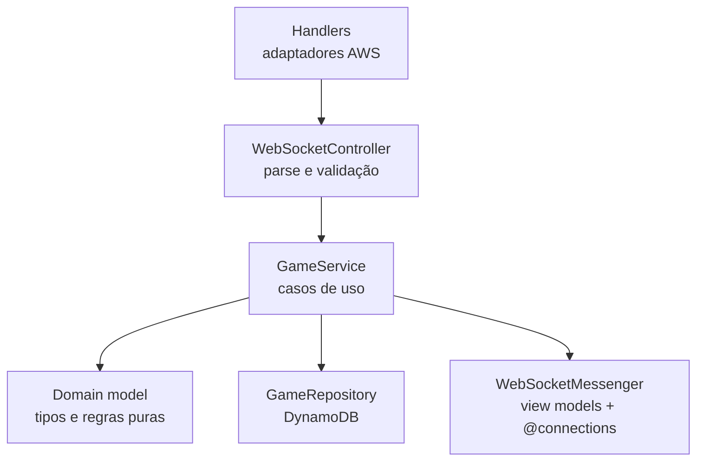
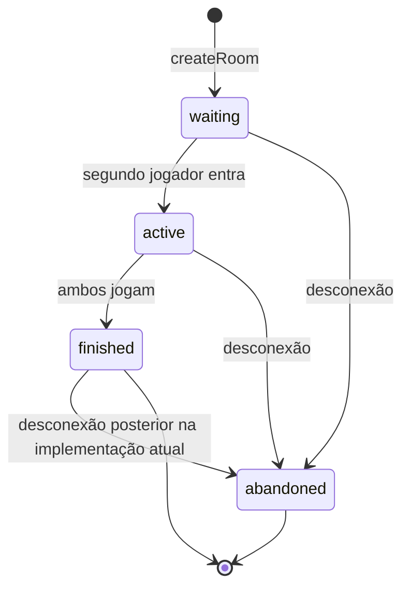

# Arquitetura

[← Índice da documentação](../README.md)

## Objetivo do desenho

A arquitetura foi construída para exercitar comunicação WebSocket bidirecional sem manter um servidor permanentemente ligado. O API Gateway conserva os sockets; cada Lambda executa apenas durante um evento; o DynamoDB guarda o estado mínimo necessário para relacionar salas e conexões.

O frontend é executado localmente e conversa com o endpoint AWS implantado. A infraestrutura deste repositório não cria hospedagem estática, S3 de frontend ou CloudFront.

## Visão de contexto

## Componentes e responsabilidades

| Componente | Responsabilidade | O que não faz |
| --- | --- | --- |
| React | interface, conexão WebSocket e estado de apresentação | não decide o vencedor no servidor |
| MediaPipe Hand Landmarker | detecta 21 pontos e classifica o gesto no dispositivo | não envia vídeo à AWS |
| Three.js / React Three Fiber | transforma landmarks em poses dos modelos GLB e renderiza a mesa | não persiste o movimento |
| API Gateway WebSocket | handshake, socket persistente, `connectionId`, routes e throttling | não executa a regra do jogo |
| Lambda `$connect` | aceita e registra a conexão nos logs | não associa o socket a uma sala |
| Lambda `$default` | executa o backend de comandos da aplicação | não permanece ativa entre mensagens |
| Lambda `$disconnect` | inicia a limpeza da conexão e o abandono da sala | não controla o fechamento do socket |
| DynamoDB | salas, escolhas e lookup `connectionId → roomCode` | não armazena frames ou movimentos da mão |
| API Gateway Management API | envia JSON a um socket específico via `@connections` | não é chamada diretamente pelo browser |
| CloudWatch | access logs, execution logs e logs das Lambdas | não contém `data_trace` completo das mensagens |
| Terraform | descreve e atualiza o runtime AWS | não cria a role OIDC global nem hospeda o frontend |

## Caminho de uma mensagem

Quando o navegador envia `{"action":"play","choice":"rock"}`:

1. o frame chega ao socket mantido pelo API Gateway;
2. a expressão `$request.body.action` produz a route key `play`;
3. como não existe uma route customizada `play`, o API Gateway usa `$default`;
4. a Lambda `default` entrega o evento ao `WebSocketController`;
5. o controller valida e converte o JSON em um comando tipado;
6. o `GameService` localiza conexão e sala, aplica as regras e usa o repository;
7. o `WebSocketMessenger` cria uma visão personalizada para cada jogador;
8. `PostToConnection` publica a resposta pelo `connectionId` de cada socket.

Essa separação evita confundir dois retornos diferentes:

- o handler retorna um status HTTP para o API Gateway sobre o processamento da route;
- o jogador recebe um evento JSON assíncrono enviado pelo endpoint `@connections`.

## Frontend

### Fluxo da webcam até o modelo 3D

Decisões relevantes:

- o vídeo permanece no dispositivo;
- landmarks ficam em `useRef`, evitando reconciliar a árvore React a cada detecção;
- o MediaPipe processa no máximo 15 detecções por segundo;
- o envio é limitado a um pacote a cada 125 ms, cerca de oito por segundo;
- quatro metacarpos ausentes nos 21 pontos do MediaPipe são interpolados para completar os 25 joints WebXR;
- posições e quaternions são suavizados durante o frame loop do Three.js;
- a cena 3D é carregada com `lazy`/`Suspense`, separando o bundle mais pesado da interface inicial.

### Privacidade e dependências externas

O pacote `handMotion` contém somente arrays de coordenadas e `handedness`. Nenhuma imagem ou stream de vídeo é transmitida pelo WebSocket. Ao ativar a câmera, entretanto, o navegador baixa o runtime WASM do MediaPipe pelo jsDelivr e o modelo do Hand Landmarker pelo Google Storage; portanto, esse recurso precisa de acesso à internet.

## Backend em camadas

O backend usa uma arquitetura em camadas inspirada em MVC. O termo “inspirada” é importante porque não existe uma view renderizada no servidor: a saída é um view model JSON específico para cada conexão.

### `handlers/`

Adaptam `APIGatewayProxyWebsocketEventV2` para a aplicação. Eles conhecem o formato AWS, mas não contêm a regra do jogo.

### `controllers/`

Convertem JSON não confiável em comandos aceitos. Aqui ficam normalização do código da sala, choices permitidas, quantidade de landmarks e limites numéricos.

### `services/`

Orquestram criar sala, entrar, jogar, desconectar e retransmitir a mão. O service conversa com repository e messenger por dependências separadas.

### `models/`

Concentram tipos e regras puras: estados da sala, posições dos jogadores e decisão do vencedor. Essa camada não importa SDKs da AWS.

### `repositories/`

Encapsulam as chaves da single table e os comandos do DynamoDB. O restante da aplicação trabalha com `Room` e `Connection`, não com `PK`, `SK` ou expressões AWS.

### `WebSocketMessenger`

Serializa payloads, personaliza o `roomState` por jogador e chama a Management API. Uma `GoneException` é tratada como condição esperada, pois o socket pode fechar depois da leitura da sala e antes do envio.

## Estado e consistência

### Modelo single-table

| Tipo de item | PK | SK | Dados principais |
| --- | --- | --- | --- |
| Sala | `ROOM#ABC123` | `ROOM` | status, jogadores, choices, vencedor e timestamps |
| Conexão | `CONNECTION#<connectionId>` | `CONNECTION` | `roomCode`, criação e TTL |

Não há GSI. O lookup por conexão é uma leitura direta pela chave; depois, uma segunda leitura obtém a sala.

### Máquina de estados

O claim do segundo jogador e o registro de cada escolha usam expressões condicionais do DynamoDB. Isso impede que dois jogadores ocupem simultaneamente `playerTwo` ou que uma conexão sobrescreva sua própria escolha.

Sala e lookup de conexão recebem `expiresAt` para TTL de 24 horas. TTL é limpeza eventual; nenhuma regra depende de o DynamoDB excluir o item em um instante exato.

## Segurança por camadas

- GitHub Actions assume uma role AWS por OIDC e credenciais de curta duração;
- actions externas são fixadas por SHA nos workflows;
- a role das Lambdas escreve somente nos seus log groups, acessa somente a tabela do jogo e gerencia somente conexões do stage;
- permissões de invocação limitam cada Lambda à API, ao stage e à route esperada;
- `data_trace_enabled` permanece desativado;
- access logs não incluem o corpo completo da mensagem;
- coordenadas recebidas precisam ser finitas, estar entre `-2` e `2` e formar exatamente 21 trios.

Limite atual: não existe authorizer, login ou identidade persistente. O código de seis caracteres é o único conhecimento exigido para entrar em uma sala em espera. Para um ambiente público de produção seriam necessários autenticação, autorização e controles adicionais contra abuso.

## Perfil de custo

A arquitetura evita custos fixos típicos de instâncias, NAT Gateway e capacidade provisionada. API Gateway, Lambda e DynamoDB são cobrados conforme uso.

O caminho mais frequente durante uma partida é `handMotion`: cada jogador pode gerar cerca de oito invocações por segundo; cada invocação faz duas leituras consistentes e um `PostToConnection`. Portanto, “serverless” e “on-demand” não significam custo zero. O throttling do stage está configurado em 50 mensagens/s, com burst 100.

## Decisões deliberadas

| Decisão | Motivo | Consequência |
| --- | --- | --- |
| API Gateway gerencia sockets | estudar o modelo WebSocket serverless da AWS | mensagens de saída exigem `@connections` |
| uma Lambda `$default` para comandos | centralizar parsing e casos de uso durante o escopo atual | API Gateway não possui uma integração por action |
| DynamoDB single-table | lookup simples e baixo overhead operacional | acesso depende das chaves desenhadas |
| movimento não persistido | evitar armazenamento sem valor para a rodada | novo cliente não recebe replay do movimento |
| frontend local | manter o foco em WebSocket e serverless backend | não há URL pública do site neste Terraform |
| sem SQS | comunicação atual é direta e pequena | não há buffer/retry assíncrono para `handMotion` |
| sem VPC/NAT | os serviços usados possuem endpoints gerenciados públicos | o runtime não tem isolamento de sub-rede privada |

## Limites funcionais atuais

- dois jogadores por sala;
- uma rodada por sala;
- sem rematch, reconexão de sessão ou espectador;
- sem autenticação;
- sem testes automatizados no repositório;
- desconectar depois de uma sala finalizada pode alterar o status persistido para `abandoned`;
- frontend precisa ser servido separadamente do Terraform atual.

Consulte também [Protocolo WebSocket](../websocket/README.md) e [Infraestrutura AWS](../infrastructure/README.md).
