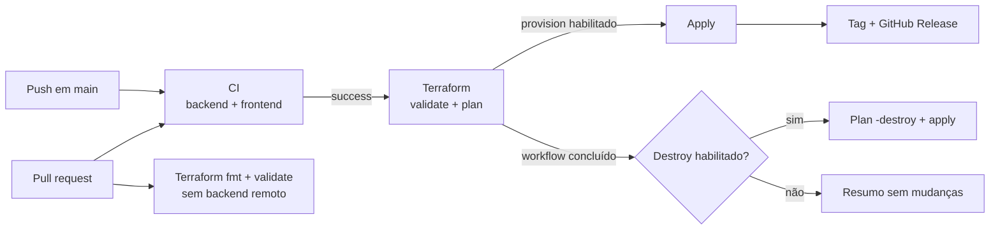
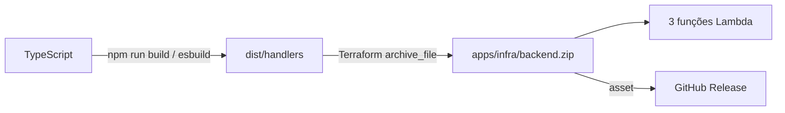

# CI/CD e releases

[← Índice da documentação](../README.md)

## Visão geral

Três workflows separam validação, provisionamento e remoção. O fluxo de `main` é encadeado por `workflow_run`, enquanto pull requests validam código e Terraform sem executar apply.



## Badges do README

```md
[](https://github.com/kaiotcp1/Websocket/actions/workflows/ci.yml)
[](https://github.com/kaiotcp1/Websocket/actions/workflows/terraform.yml)
[](https://github.com/kaiotcp1/Websocket/actions/workflows/destroy.yml)
[](https://github.com/kaiotcp1/Websocket/releases/latest)
```

Interpretação correta:

- CI verde significa type-check/build do backend e build do frontend aprovados;
- Terraform verde significa que as condições executadas terminaram sem erro, não que apply necessariamente ocorreu;
- Destroy verde também pode representar o no-op seguro quando o controle estava desabilitado;
- Latest release mostra a tag mais recente, não o estado atual da AWS;
- não há suíte ou cobertura automatizada, portanto não existe badge de coverage;
- não há `LICENSE` na raiz, portanto não existe badge de licença do projeto.

## Workflow `CI`

Arquivo: `.github/workflows/ci.yml`

Triggers:

- push em `main`;
- pull request para `main`;
- execução manual.

Permissão global: `contents: read`.

### Validate backend

```text
checkout
→ Node.js 22 com cache npm
→ npm ci
→ npm run typecheck
→ npm run build
```

### Validate frontend

```text
checkout
→ Node.js 22 com cache npm
→ npm ci
→ npm run build
```

Os jobs são independentes e podem executar em paralelo. A concurrency cancela um run anterior da mesma ref quando um commit mais novo chega:

```text
websocket-ci-<workflow>-<ref>
```

Atualmente não há lint ou testes automatizados; a CI comprova instalação reproduzível, tipos do backend e compilação dos dois aplicativos.

## Workflow `Terraform`

Arquivo: `.github/workflows/terraform.yml`

Triggers:

- pull request para `main`;
- conclusão do workflow `CI` em `main`;
- execução manual.

A concurrency `websocket-runtime-<branch/ref>` não cancela um run em andamento. O destroy usa o mesmo grupo para evitar duas operações simultâneas sobre o runtime.

### Validate Terraform

Executa em PR e no fluxo de `main`:

```bash
terraform fmt -check -recursive
terraform init -backend=false -input=false
terraform validate
```

Essa fase não acessa o state remoto nem solicita token OIDC.

### Plan Terraform

Executa fora de pull request, em `main`, depois de validação e CI bem-sucedida:

1. faz checkout do commit validado;
2. instala Node.js 22;
3. executa `npm ci` e build do backend;
4. instala Terraform 1.15.8;
5. lê os controles de `apps/infra/locals.tf`;
6. rejeita provisionamento e destroy habilitados simultaneamente;
7. assume a role AWS por OIDC;
8. inicializa o backend remoto;
9. cria `tfplan`, gerando também `backend.zip` por `archive_file`;
10. publica no Job Summary quantos recursos serão criados, atualizados ou removidos.

O plan exporta os controles para decidir os jobs posteriores. O `tfplan` desse job não é usado pelo apply, pois cada job possui um runner isolado.

### Deploy WebSocket infrastructure

Executa somente com esta combinação:

```hcl
provision_infrastructure = true
destroy_infrastructure   = false
```

O job:

- recebe `id-token: write` para OIDC;
- recebe `contents: write` para tag e release;
- repete build e `terraform init` no próprio runner;
- cria um novo plano e aplica exatamente esse arquivo no mesmo job;
- escreve endpoint WebSocket e API ID no summary;
- cria versão/release somente depois do apply bem-sucedido.

Essa ordem impede uma release que represente um deploy com falha.

## Workflow `Destroy WebSocket runtime`

Arquivo: `.github/workflows/destroy.yml`

Triggers:

- conclusão bem-sucedida do workflow Terraform em `main`;
- execução manual em `main`.

O job lê `apps/infra/locals.tf`. Somente autentica na AWS e altera recursos se `destroy_infrastructure = true`.

Quando habilitado:

```text
build backend
→ OIDC
→ terraform init com state remoto
→ terraform plan -destroy -out=tfplan
→ terraform apply tfplan
```

Quando desabilitado, escreve um summary informando que nenhuma mudança ocorreu.

> Antes de enviar qualquer alteração para `main`, revise os dois controles. Um commit com `destroy_infrastructure = true` pode remover o runtime assim que CI e Terraform terminarem.

## Matriz dos controles

| Provision | Destroy | Efeito esperado |
| --- | --- | --- |
| `true` | `false` | Terraform aplica e pode gerar release; destroy faz no-op |
| `false` | `true` | apply é pulado; destroy remove recursos pelo state |
| `false` | `false` | nenhuma mudança de lifecycle é aplicada |
| `true` | `true` | workflows falham na validação dos controles |

Os controles pertencem à automação. O HCL dos recursos permanece completo e um plan local continua representando a infraestrutura desejada.

## OIDC com AWS

Os workflows não usam `AWS_ACCESS_KEY_ID` ou `AWS_SECRET_ACCESS_KEY` armazenados em secrets.

Configuração visível:

```text
AWS_REGION     = us-east-1
AWS_ACCOUNT_ID = 761018861028
AWS_ROLE_ARN   = arn:aws:iam::761018861028:role/github-actions-deploy-role
```

Nos jobs que acessam a AWS:

- `permissions.id-token = write` permite solicitar o JWT do GitHub;
- `aws-actions/configure-aws-credentials` troca o JWT por credenciais temporárias;
- a sessão recebe nome com `github.run_id` e duração solicitada de 3600 segundos;
- a conta permitida é conferida;
- o account ID é mascarado nos logs.

Provider OIDC, trust policy, role global e sua policy não são criados neste projeto. O Terraform cria somente as roles de runtime sob `/github-actions-passable/`, path que funciona como contrato para o `iam:PassRole` autorizado externamente.

Todas as actions externas estão pinadas por SHA, reduzindo o risco de uma tag mutável trocar silenciosamente o código executado.

## State compartilhado

Plan, apply e destroy usam:

```text
s3://terraform-states-761018861028-us-east-1/websocket/dev/terraform.tfstate
```

O backend habilita criptografia e lockfile S3. Isso permite que runners diferentes observem o mesmo estado e reduz o risco de escritas concorrentes.

O bucket é externo. O workflow não cria, versiona ou destrói esse bucket. Consulte [Infraestrutura AWS](../infrastructure/README.md).

## ZIP das Lambdas



O ZIP é gerado durante plan/apply e não é versionado. A release publica o arquivo com label `Lambda handlers ZIP`. Um SHA-256 é incluído nas notas para rastreabilidade.

## Versionamento semântico

Configuração: `.releaserc.json`

```text
branch    = main
tagFormat = v${version}
```

O primeiro deploy bem-sucedido sem tags compatíveis cria `v0.1.0`. Depois, `semantic-release` analisa commits posteriores à última versão:

| Commit | Incremento | Exemplo |
| --- | --- | --- |
| `fix: ...` | patch | `v0.4.0 → v0.4.1` |
| `feat: ...` | minor | `v0.4.0 → v0.5.0` |
| `feat!: ...` | major | `v0.4.0 → v1.0.0` |
| footer `BREAKING CHANGE:` | major | `v0.4.0 → v1.0.0` |
| somente `docs:`, `test:`, `build:` ou `chore:` | nenhuma release | tag não é criada |

As notas da release incluem changelog, commit, URL WebSocket, API ID, região, runtime, versão Terraform, SHA-256 e o ZIP.

Se nenhum commit justificar nova versão, `semantic-release` não cria tag. O token da release é o `github.token` efêmero do workflow.

## Conventional Commits

Exemplos:

```text
feat(frontend): animate tracked WebXR hand
fix(backend): return draw for equal choices
docs: explain WebSocket message flow
refactor(backend): isolate DynamoDB repository
```

Consulte [CONTRIBUTING.md](../../CONTRIBUTING.md).

## Considerações operacionais

- não faça deploy/destroy concorrente fora do state e da concurrency compartilhados;
- confira o plan, principalmente contagens de delete;
- um badge verde não prova que o endpoint está atualmente implantado;
- não altere bucket/key sem planejar migração de state;
- não publique credenciais em `.tfvars`, workflows ou logs;
- não há rollback automático; recuperação exige novo commit/apply ou aplicação consciente de uma versão anterior.
