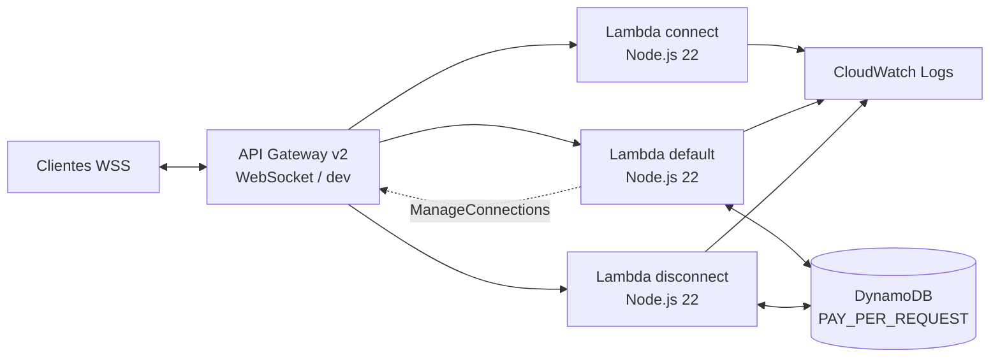
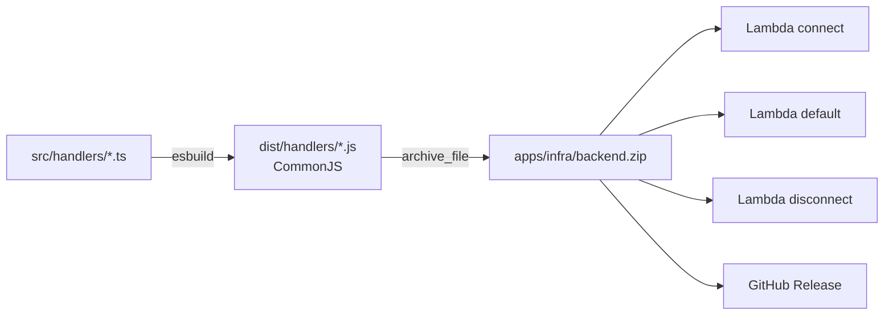

# Infraestrutura AWS

[← Índice da documentação](../README.md)

## Escopo

Terraform implanta o runtime WebSocket em `us-east-1`. O frontend não faz parte deste módulo e continua sendo servido separadamente.

Não existem neste desenho:

- VPC ou subnets;
- NAT Gateway;
- SQS;
- ElastiCache;
- EC2, ECS ou Fargate;
- S3/CloudFront para o frontend;
- servidor WebSocket persistente.

## Topologia



## Recursos gerenciados

Com os valores padrão `project_name = "rock-paper-scissors"` e `environment = "dev"`:

| Recurso | Nome ou característica |
| --- | --- |
| API Gateway v2 | `rock-paper-scissors-dev`, protocolo `WEBSOCKET` |
| Stage | `dev` |
| Lambda connect | `rock-paper-scissors-dev-connect` |
| Lambda default | `rock-paper-scissors-dev-default` |
| Lambda disconnect | `rock-paper-scissors-dev-disconnect` |
| Runtime | `nodejs22.x` |
| DynamoDB | `rock-paper-scissors-dev-game`, `PAY_PER_REQUEST` |
| IAM runtime role | `/github-actions-passable/rock-paper-scissors-dev-lambda-execution` |
| IAM CloudWatch role | `/github-actions-passable/rock-paper-scissors-dev-api-gateway-cloudwatch` |
| Access log | `/aws/apigateway/rock-paper-scissors-dev` |
| Lambda logs | `/aws/lambda/rock-paper-scissors-dev-{connect,default,disconnect}` |
| Retenção | sete dias por padrão |

Todos recebem tags comuns quando o recurso oferece suporte:

```text
Project     = rock-paper-scissors
Environment = dev
ManagedBy   = Terraform
Service     = websocket
```

## Organização dos arquivos Terraform

| Arquivo | Responsabilidade |
| --- | --- |
| `versions.tf` | versões, providers, backend S3 e região do provider |
| `variables.tf` | região, ambiente, nome e retenção de logs |
| `locals.tf` | controles operacionais lidos pelos workflows |
| `main.tf` | API Gateway, Lambdas, DynamoDB, logs, integrações e stage |
| `iam.tf` | trust policies, permissões runtime e invocações |
| `outputs.tf` | endpoint e identificadores operacionais |
| `terraform.tfvars.example` | exemplo seguro de customização não secreta |

## State remoto

O backend S3 está declarado em `versions.tf`:

| Propriedade | Valor |
| --- | --- |
| Bucket | `terraform-states-761018861028-us-east-1` |
| Key | `websocket/dev/terraform.tfstate` |
| Região | `us-east-1` |
| Criptografia do objeto | habilitada pelo backend (`encrypt = true`) |
| Lock | arquivo de lock S3 (`use_lockfile = true`) |

Plan, apply e destroy inicializam o mesmo backend. Assim, Terraform compara a configuração com o state compartilhado e identifica criações, mudanças e remoções mesmo em runners diferentes do GitHub Actions.

> O bucket é global e preexistente. Este repositório não cria o bucket, não configura sua policy e não comprova se o versionamento S3 está habilitado. Também não existe uma tabela DynamoDB de lock.

O destroy remove os recursos rastreados, mas não apaga o bucket externo. O objeto de state continua existindo e passa a representar uma infraestrutura vazia.

## Empacotamento das Lambdas

O Terraform não executa TypeScript diretamente. O fluxo do artefato é:



As três funções recebem o mesmo ZIP e usam handlers diferentes. `source_code_hash` faz o provider detectar mudanças no conteúdo.

Antes de `terraform plan` ou `apply` local:

```bash
cd apps/backend
npm ci
npm run typecheck
npm run build

cd ../infra
terraform init
terraform plan
```

`dist/`, `backend.zip`, planos, state e `terraform.tfvars` local são ignorados pelo Git.

## API Gateway WebSocket

A API usa:

```hcl
protocol_type              = "WEBSOCKET"
route_selection_expression = "$request.body.action"
```

Routes implantadas:

- `$connect` → Lambda connect;
- `$disconnect` → Lambda disconnect;
- `$default` → Lambda default.

Comandos de aplicação caem em `$default` e são roteados pelo controller. Um deployment versiona routes e integrações; o stage `dev` aponta para esse deployment.

Configuração de proteção operacional:

| Opção | Valor |
| --- | --- |
| Logging | `INFO` |
| Data trace | desativado |
| Rate limit | 50 mensagens/s |
| Burst | 100 mensagens |

O stage depende de `aws_api_gateway_account.websocket`, que configura a role do CloudWatch em nível de conta/região. Esse é um cuidado importante: a configuração não pertence exclusivamente a esta API e pode ser compartilhada por outros API Gateways em `us-east-1`.

## DynamoDB

A tabela utiliza chave composta sem GSI:

| Item | PK | SK |
| --- | --- | --- |
| Sala | `ROOM#<código>` | `ROOM` |
| Lookup de conexão | `CONNECTION#<connectionId>` | `CONNECTION` |

Características:

- capacidade `PAY_PER_REQUEST`;
- TTL no atributo `expiresAt`;
- sala e conexão expiram após 24 horas;
- leituras de sala e conexão usam `ConsistentRead`;
- updates condicionais protegem vaga e escolha;
- movimento da mão não é persistido.

TTL é uma limpeza assíncrona do DynamoDB. A aplicação usa os status `waiting`, `active`, `finished` e `abandoned` e não depende da hora exata em que um item expirado será removido.

## IAM

### Role das Lambdas

Trust:

```text
lambda.amazonaws.com → sts:AssumeRole
```

Permissões inline:

- `logs:CreateLogStream` e `logs:PutLogEvents` somente nos log groups das funções;
- `dynamodb:GetItem`, `PutItem`, `UpdateItem` e `DeleteItem` somente na tabela do jogo;
- `execute-api:ManageConnections` somente em `/<stage>/POST/@connections/*` desta API.

### Invocação das funções

Cada `aws_lambda_permission` limita `apigateway.amazonaws.com` ao ARN da API, stage e route correspondentes.

### CloudWatch do API Gateway

Uma role separada confia em `apigateway.amazonaws.com` e anexa a policy gerenciada `AmazonAPIGatewayPushToCloudWatchLogs`.

### Role OIDC do GitHub Actions

`github-actions-deploy-role` é global e externa a este Terraform. Os workflows a assumem com token OIDC de curta duração. O path `/github-actions-passable/` das roles criadas é o contrato visível para `iam:PassRole`; a policy real da role global precisa ser administrada fora deste repositório.

## Logs e observabilidade

### Access logs

O API Gateway grava JSON com:

- `requestId`;
- `connectionId`;
- `routeKey`;
- `status`;
- `eventType`;
- mensagem de erro de contexto.

O corpo e os landmarks não fazem parte do formato de access log.

### Lambda logs

```bash
aws logs tail "/aws/lambda/rock-paper-scissors-dev-default" \
  --since 10m \
  --follow \
  --region us-east-1
```

No Git Bash para Windows, desative a conversão automática do caminho iniciado por `/`:

```bash
MSYS_NO_PATHCONV=1 aws logs tail /aws/lambda/rock-paper-scissors-dev-default \
  --since 10m \
  --follow \
  --region us-east-1
```

Os execution logs usam um nome com o ID da API:

```text
API-Gateway-Execution-Logs_<api-id>/dev
```

## Variáveis

| Variável | Padrão | Uso |
| --- | --- | --- |
| `aws_region` | `us-east-1` | região dos recursos |
| `environment` | `dev` | stage e sufixo dos nomes |
| `project_name` | `rock-paper-scissors` | prefixo e tags |
| `log_retention_days` | `7` | retenção de log groups |

Para customização local:

```bash
cd apps/infra
cp terraform.tfvars.example terraform.tfvars
```

Credenciais AWS não pertencem ao `.tfvars`. Use AWS CLI/profile ou variáveis de ambiente adequadas.

## Outputs

| Output | Uso |
| --- | --- |
| `websocket_url` | endpoint `wss://` do cliente |
| `websocket_api_id` | localizar API e execution log |
| `stage_name` | nome incluído no endpoint |
| `lambda_function_names` | nomes das três funções |
| `game_table_name` | tabela que contém salas e conexões |

```bash
terraform output -raw websocket_url
terraform output -json lambda_function_names
```

## Controles de provisionamento e destroy

`apps/infra/locals.tf` possui dois controles lidos pelos workflows, não pelos recursos Terraform:

| `provision_infrastructure` | `destroy_infrastructure` | Resultado da automação |
| --- | --- | --- |
| `true` | `false` | plan e apply do runtime |
| `false` | `true` | workflow de destroy executa `plan -destroy` e apply |
| `false` | `false` | valida/planeja conforme o workflow, sem provisionar ou destruir |
| `true` | `true` | configuração inválida; workflow falha antes de alterar AWS |

> Sempre revise os valores atuais antes de enviar alterações para `main`. Um commit com destroy habilitado pode remover o runtime depois que CI e Terraform concluírem.

Esses controles não condicionam recursos com `count` ou `for_each`; por isso, um `terraform plan` local continua mostrando a configuração completa.

## Custo e ciclo de vida

O desenho reduz custo ocioso por usar serviços gerenciados e DynamoDB on-demand e por não criar NAT Gateway. Durante uma partida, o principal volume vem de `handMotion`: até cerca de oito invocações Lambda, duas leituras consistentes e uma mensagem `@connections` por segundo, por jogador.

Considere ainda:

- minutos e armazenamento do GitHub Actions;
- CloudWatch Logs durante a retenção;
- state e lock no bucket S3 global;
- chamadas de API Gateway, Lambda, DynamoDB e transferência.

Consulte [CI/CD e releases](../ci-cd/README.md) para o fluxo automatizado.
