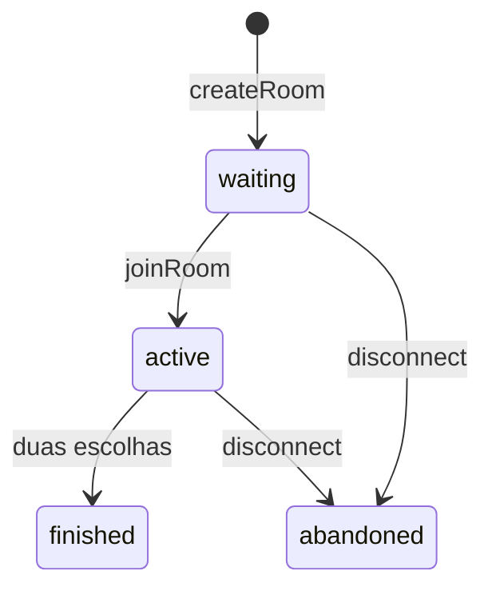

# Protocolo WebSocket

[← Índice da documentação](../README.md)

## Finalidade

Este documento descreve o contrato implementado entre o frontend e o backend. Os nomes, campos e validações vêm de `websocket-controller.ts`, `game-service.ts` e `websocket-messenger.ts`.

## Conceito essencial

Em uma API HTTP tradicional, o corpo retornado pela Lambda costuma ser a resposta vista pelo cliente. Nesta API WebSocket há duas operações diferentes:

1. a Lambda retorna `statusCode` ao API Gateway para confirmar o processamento da route;
2. o backend usa `ApiGatewayManagementApiClient` e `PostToConnection` para enviar o evento de aplicação ao `connectionId` desejado.

O socket permanece no API Gateway. A Lambda termina depois de cada evento e não conserva memória entre invocações.

## Conexão e roteamento

O cliente abre uma conexão com o stage:

```text
wss://<api-id>.execute-api.us-east-1.amazonaws.com/dev
```

O API Gateway está configurado com:

```hcl
route_selection_expression = "$request.body.action"
```

Existem somente três routes de infraestrutura:

| Route | Integração | Uso |
| --- | --- | --- |
| `$connect` | Lambda `connect` | aceita e registra a abertura do socket |
| `$disconnect` | Lambda `disconnect` | limpa a conexão e abandona a sala |
| `$default` | Lambda `default` | recebe os comandos de aplicação |

Os valores `createRoom`, `joinRoom`, `play` e `handMotion` não têm routes próprias no API Gateway. Por isso caem em `$default`, e o `WebSocketController` faz o despacho dentro da aplicação.

Ao conectar, o API Gateway cria um `connectionId`. Ele identifica somente aquele socket; não é login, usuário ou identidade durável. O projeto associa o `connectionId` a uma sala apenas quando a conexão cria ou entra nela.

## Cliente → servidor

Toda mensagem de aplicação é um objeto JSON com `action`.

### Criar sala

```json
{
  "action": "createRoom"
}
```

Efeito:

- gera um código alfanumérico uppercase de seis caracteres;
- tenta até cinco códigos em caso de colisão;
- cria uma sala `waiting` com o socket atual como `playerOne`;
- salva o lookup da conexão;
- envia `roomState` ao criador.

### Entrar em sala

```json
{
  "action": "joinRoom",
  "roomCode": "A1B2C3"
}
```

Validação e normalização:

- espaços nas extremidades são removidos;
- o valor é convertido para uppercase;
- o formato final deve conter exatamente seis caracteres `[A-Z0-9]`;
- a sala precisa estar em `waiting` e sem `playerTwo`.

O claim é atômico no DynamoDB. Duas conexões concorrendo pela última vaga não conseguem ocupar `playerTwo` ao mesmo tempo.

### Registrar jogada

```json
{
  "action": "play",
  "choice": "rock"
}
```

`choice` aceita:

| Valor | Significado |
| --- | --- |
| `rock` | pedra |
| `paper` | papel |
| `scissors` | tesoura |

O jogador precisa pertencer a uma sala `active` e ainda não ter jogado. A gravação usa uma condição no DynamoDB para impedir sobrescrita ou uma escolha depois do encerramento.

No frontend, o gesto precisa permanecer reconhecido por 850 ms antes de `play` ser enviado. Esse debounce não faz parte do protocolo do servidor; outro cliente WebSocket pode enviar a mensagem diretamente.

### Compartilhar movimento da mão

Forma do comando:

```ts
type HandLandmark = [number, number, number];

interface HandMotionCommand {
  action: 'handMotion';
  landmarks: HandLandmark[];       // exatamente 21 pontos
  worldLandmarks?: HandLandmark[]; // exatamente 21 pontos, se presente
  handedness?: 'Left' | 'Right';
}
```

Validação:

- `landmarks` é obrigatório e precisa ter exatamente 21 trios;
- cada coordenada precisa ser um número finito entre `-2` e `2`;
- `worldLandmarks` usa a mesma validação, mas é opcional;
- `handedness` é opcional e aceita somente `Left` ou `Right`;
- `worldLandmarks` ou `handedness` inválidos são descartados sem invalidar landmarks principais válidos.

Comportamento:

- o frontend só envia movimento quando a sala está `active`;
- o MediaPipe detecta até 15 vezes por segundo;
- a rede é limitada a um pacote a cada 125 ms, aproximadamente oito por segundo;
- o backend lê conexão e sala, localiza o oponente e retransmite o pacote;
- movimentos não são escritos no DynamoDB.

## Servidor → cliente

Toda mensagem de saída possui `type`.

### Erro

```json
{
  "type": "error",
  "message": "Descrição legível do erro"
}
```

Erros de domínio são enviados ao socket que originou o comando. JSON ausente, action desconhecida ou payload inválido recebem status 400 na route e um evento `error`.

Uma falha inesperada gera log, tenta enviar uma mensagem genérica ao cliente e faz o handler retornar status 500 ao API Gateway.

### Estado da sala

Durante uma partida:

```json
{
  "type": "roomState",
  "room": {
    "code": "A1B2C3",
    "status": "active",
    "players": {
      "playerOne": true,
      "playerTwo": true
    },
    "youAre": "playerOne",
    "youHavePlayed": false,
    "opponentHasPlayed": true
  }
}
```

Depois das duas escolhas:

```json
{
  "type": "roomState",
  "room": {
    "code": "A1B2C3",
    "status": "finished",
    "players": {
      "playerOne": true,
      "playerTwo": true
    },
    "yourChoice": "rock",
    "opponentChoice": "scissors",
    "winner": "playerOne",
    "youAre": "playerOne",
    "youHavePlayed": true,
    "opponentHasPlayed": true
  }
}
```

Campos:

| Campo | Tipo | Observação |
| --- | --- | --- |
| `code` | string | código uppercase de seis caracteres |
| `status` | string | `waiting`, `active`, `finished` ou `abandoned` |
| `players.playerOne` | boolean | presença do primeiro socket |
| `players.playerTwo` | boolean | presença do segundo socket |
| `youAre` | string opcional | `playerOne` ou `playerTwo` |
| `youHavePlayed` | boolean | escolha do destinatário já existe |
| `opponentHasPlayed` | boolean | escolha do outro jogador já existe |
| `yourChoice` | choice opcional | enviado somente quando a sala terminou |
| `opponentChoice` | choice opcional | enviado somente quando a sala terminou |
| `winner` | string opcional | `playerOne`, `playerTwo` ou `draw` ao terminar |

O payload é montado separadamente para cada `connectionId`. Antes de `finished`, as escolhas ficam ocultas; apenas os booleanos de progresso são revelados.

### Movimento remoto

```ts
interface HandMotionEvent {
  type: 'handMotion';
  landmarks: HandLandmark[];
  worldLandmarks?: HandLandmark[];
  handedness?: 'Left' | 'Right';
}
```

O evento é enviado somente ao oponente. O frontend mantém compatibilidade com um backend anterior: se `worldLandmarks` estiver ausente, reutiliza `landmarks` para animar o modelo.

## Fluxo completo da partida

```mermaid
sequenceDiagram
    autonumber
    actor J1 as Jogador 1
    participant F1 as Frontend 1
    participant GW as API Gateway WebSocket
    participant CON as Lambda $connect
    participant DEF as Lambda $default
    participant APP as Controller + GameService
    participant DB as DynamoDB
    participant MGMT as API Gateway @connections
    participant F2 as Frontend 2
    actor J2 as Jogador 2

    J1->>F1: Conectar
    F1->>GW: Upgrade WSS
    GW->>CON: $connect(connectionId)
    CON-->>GW: statusCode 200

    F1->>GW: createRoom
    GW->>DEF: $default
    DEF->>APP: comando validado
    APP->>DB: Put ROOM + CONNECTION
    APP->>MGMT: PostToConnection(roomState waiting)
    MGMT-->>F1: código da sala

    J2->>F2: Entrar com o código
    F2->>GW: Upgrade WSS
    GW->>CON: $connect(connectionId)
    CON-->>GW: statusCode 200
    F2->>GW: joinRoom + código
    GW->>DEF: $default
    DEF->>APP: joinRoom
    APP->>DB: claim condicional de playerTwo
    APP->>MGMT: roomState personalizado para ambos
    MGMT-->>F1: active como playerOne
    MGMT-->>F2: active como playerTwo

    loop Aproximadamente 8 pacotes/s enquanto active
        F1->>GW: handMotion(21 pontos)
        GW->>DEF: $default
        DEF->>APP: shareHandMotion
        APP->>DB: Get CONNECTION + ROOM
        APP->>MGMT: PostToConnection(jogador 2)
        MGMT-->>F2: handMotion
    end

    F1->>GW: play(rock)
    GW->>DEF: $default
    DEF->>APP: play
    APP->>DB: salva escolha condicionalmente
    APP->>MGMT: roomState com escolha oculta
    MGMT-->>F1: youHavePlayed = true
    MGMT-->>F2: opponentHasPlayed = true

    F2->>GW: play(scissors)
    GW->>DEF: $default
    DEF->>APP: play
    APP->>DB: salva, calcula e finaliza
    APP->>MGMT: roomState finished para ambos
    MGMT-->>F1: rock × scissors; playerOne
    MGMT-->>F2: scissors × rock; playerOne
```

## Estados e regra de vencedor



| Primeira escolha | Segunda escolha | Resultado |
| --- | --- | --- |
| iguais | iguais | `draw` |
| `rock` | `scissors` | primeira vence |
| `paper` | `rock` | primeira vence |
| `scissors` | `paper` | primeira vence |
| qualquer outro par válido | — | segunda vence |

Uma sala representa uma rodada. Não existe action de rematch; depois de `finished` ou `abandoned`, os clientes precisam criar outra sala.

## Desconexão

Quando o socket fecha:

- o API Gateway invoca `$disconnect`;
- o lookup `CONNECTION#<connectionId>` é excluído;
- a sala associada é marcada como `abandoned`;
- o novo `roomState` é enviado ao socket restante.

Uma conexão pode fechar entre a leitura do DynamoDB e o envio. Por isso, `GoneException`/HTTP 410 em `PostToConnection` é ignorada como condição esperada.

Na implementação atual, `disconnect` marca a sala como `abandoned` mesmo se ela já estava `finished`.

## Privacidade, segurança e capacidade

- o vídeo nunca entra no payload;
- não há autenticação ou authorizer;
- uma sala comporta no máximo dois sockets;
- o stage limita a taxa a 50 mensagens/s e burst 100;
- `connectionId` não deve ser tratado como identidade de usuário;
- códigos de sala não substituem autorização em um produto público;
- `handMotion` é o caminho de maior volume e gera invocação Lambda, leituras consistentes e `PostToConnection` a cada pacote.

## Teste manual com `wscat`

```bash
npx --yes wscat -c wss://<api-id>.execute-api.us-east-1.amazonaws.com/dev
```

Depois da conexão:

```json
{"action":"createRoom"}
```

Em outro terminal:

```json
{"action":"joinRoom","roomCode":"A1B2C3"}
```

Para jogar:

```json
{"action":"play","choice":"rock"}
```

Uma mensagem como `{"action":"ping"}` não possui route/comando implementado e recebe um evento `error`.

Veja [Desenvolvimento local](../development/README.md) para testes em dois dispositivos e comandos de logs.
